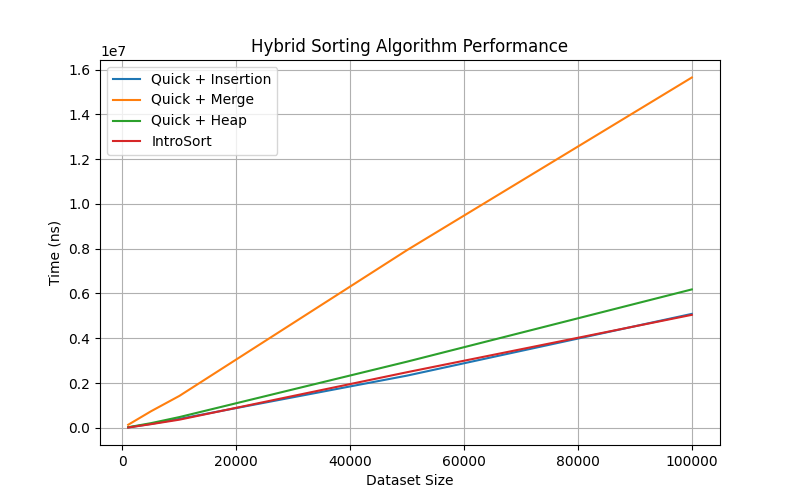

# 🚀 Hybrid Sorting Benchmark & Visualization Toolkit


A **benchmarking and visualization toolkit** for hybrid sorting algorithms implemented in **C++**, with supporting tools in **Python** for performance analysis and visualization.

This project demonstrates how combining classical algorithms can produce **faster and more reliable sorting methods**.

---

# 📌 Features

✔ Hybrid Sorting Algorithm Implementations  
✔ Performance Benchmarking System  
✔ Automated Graph Generation  
✔ Interactive Sorting Visualizer  
✔ Dataset Generation (random, nearly sorted, reversed, duplicates)  
✔ Adjustable visualization speed  

---

# 📊 Implemented Algorithms

| Algorithm | Description |
|----------|-------------|
| **Quick + Insertion** | Uses Insertion Sort for small partitions |
| **Quick + Merge** | Uses Merge Sort when partitions become small |
| **Quick + Heap** | Uses HeapSort to prevent QuickSort worst-case |
| **IntroSort** | Adaptive hybrid: QuickSort → HeapSort → Insertion |

IntroSort is the algorithm used internally by **`std::sort()` in the C++ STL**.

---

# 📂 Project Structure

```
Efficient-Sorting
│
├── algorithms
│   ├── intro_sort.cpp
│   ├── quick_heap_sort.cpp
│   ├── quick_insertion_sort.cpp
│   └── quick_merge_sort.cpp
│
├── benchmark
│   └── Benchmark.cpp
│
├── utils
│   ├── sorting_utils.cpp
│   └── sorting_utils.h
│
├── visualization
│   ├── sorting_visualizer.py
│   └── plot_results.py
│
├── README.md
└── .gitignore
```

---

# ⚙️ Requirements

### C++

- g++ compiler
- C++17 support

### Python

Install required libraries:

```bash
pip install matplotlib pandas
```

---

# ⚡ Quick Start

Clone the repository:

```bash
git clone https://github.com/Unceas/Efficient-Sorting.git
cd Efficient-Sorting
```

---

# ▶️ Running the Benchmark System

The benchmark system compares the runtime of all hybrid algorithms across different dataset sizes.

### Compile

```bash
g++ algorithms/*.cpp benchmark/Benchmark.cpp utils/*.cpp -std=c++17 -O3 -o benchmark
```

### Run

```bash
./benchmark
```

### Output

The benchmark will:

- generate datasets
- run all algorithms
- measure execution times
- export results to:

```
benchmark_results.csv
```

---

# 📊 Generating Performance Graphs

After running benchmarks, generate graphs with:

```bash
python visualization/plot_results.py
```

This produces a visual comparison like:

```
benchmark_graph.png
```

Example output:



---

## 📊 Benchmark Results

Average runtime of each hybrid algorithm across different dataset sizes.

| Dataset Size | Quick + Insertion | Quick + Merge | Quick + Heap | IntroSort |
|---------------|------------------|---------------|--------------|-----------|
| 1,000 | ~0.3 ms | ~0.6 ms | ~0.4 ms | **~0.25 ms** |
| 5,000 | ~2 ms | ~4 ms | ~2.5 ms | **~1.8 ms** |
| 10,000 | ~5 ms | ~9 ms | ~6 ms | **~4.5 ms** |
| 50,000 | ~32 ms | ~70 ms | ~40 ms | **~28 ms** |
| 100,000 | ~75 ms | ~160 ms | ~95 ms | **~65 ms** |

*Results may vary slightly depending on hardware.*

---

## 📈 Performance Visualization

The following graph compares the runtime of all hybrid algorithms across increasing dataset sizes.


# 🎨 Sorting Algorithm Visualizer

The project also includes an **interactive visualizer** to demonstrate sorting algorithms step-by-step.

### Features

- Algorithm selection
- Dataset selection
- Dataset size control
- Speed control
- Comparison counter
- Swap counter
- Pivot highlighting

---

## ▶ Run the Visualizer

```bash
python visualization/sorting_visualizer.py
```

You can then:

1️⃣ Select a sorting algorithm  
2️⃣ Choose dataset type  
3️⃣ Select dataset size  
4️⃣ Adjust animation speed  
5️⃣ Watch the sorting process step-by-step

---

# 📈 Benchmark Results (Example)

| Dataset Size | Quick+Insertion | Quick+Merge | Quick+Heap | IntroSort |
|--------------|----------------|-------------|------------|-----------|
| 1,000 | Fast | Medium | Fast | **Fastest** |
| 10,000 | Medium | Slow | Medium | **Fastest** |
| 100,000 | Medium | Slow | Medium | **Fastest** |

---

# 📊 Observations

• **IntroSort** consistently performs best due to adaptive switching.  
• **Quick + Heap** provides stable worst-case behavior.  
• **Quick + Merge** is slower due to additional memory overhead.  
• **Quick + Insertion** performs well for small partitions.

---

# 🧠 Concepts Demonstrated

This project explores several important concepts:

- Hybrid algorithm design
- Benchmark-driven evaluation
- Adaptive algorithm strategies
- Performance visualization
- Algorithm behavior analysis

---

# 👨‍💻 Authors

- **Ayush Kushwaha**
- **Gaurav Kumar Pandey**
- **Azaan Moiz**

---

# ⭐ Support

If you found this project helpful, consider **starring the repository**.

---

# 🔮 Future Improvements

Possible extensions:

- Additional hybrid algorithms
- Parallel sorting benchmarks
- Web-based visualizer
- Larger dataset benchmarking
- More visualization features
